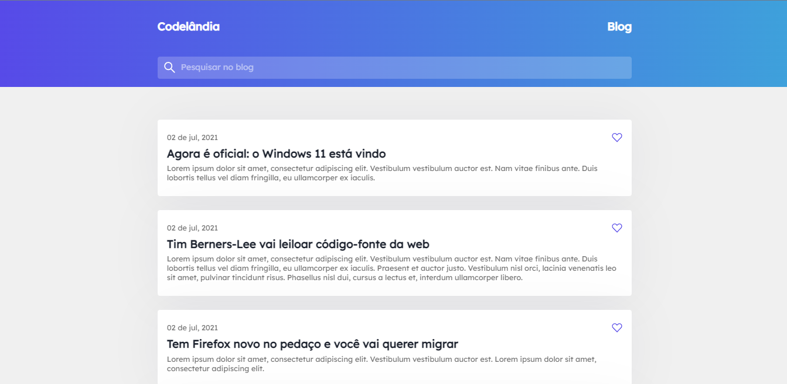
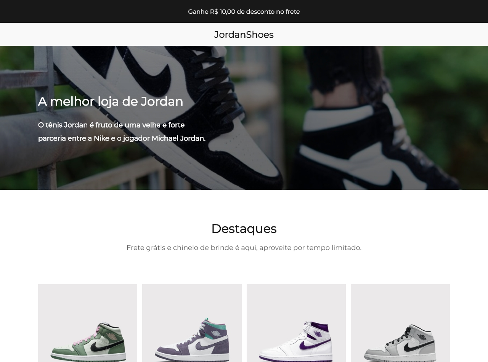
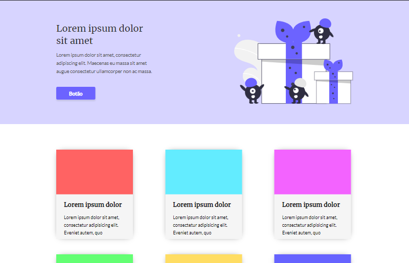
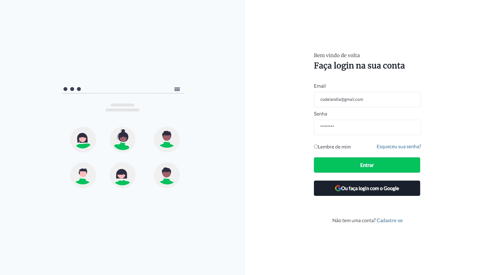
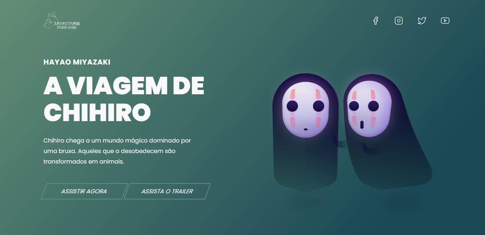
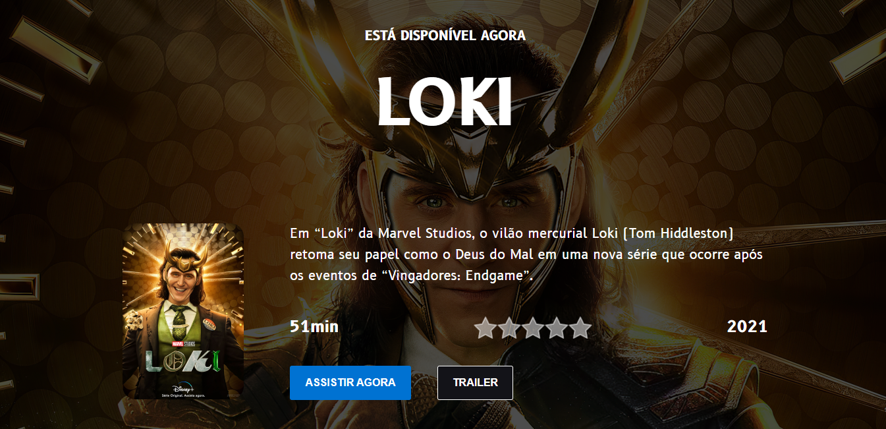
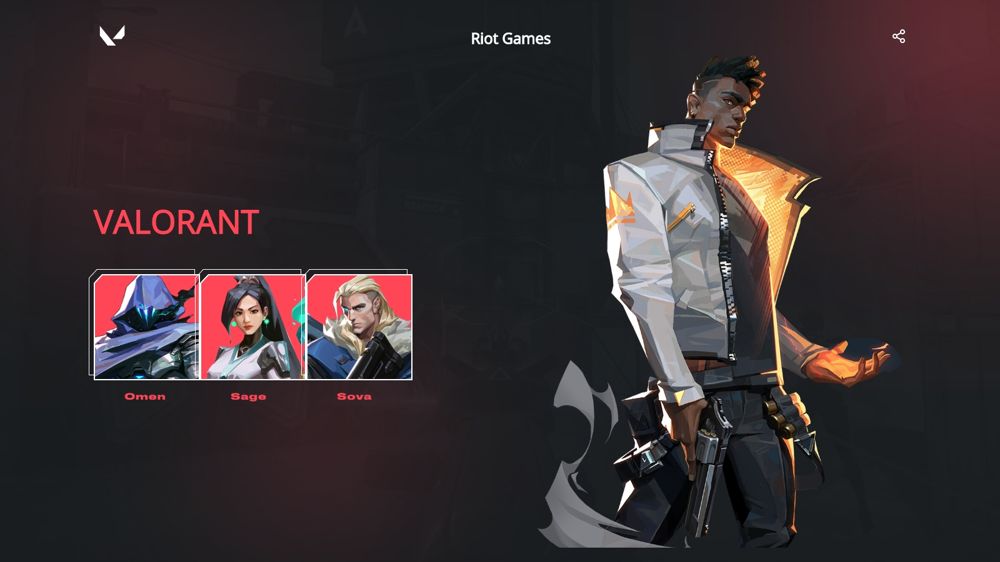
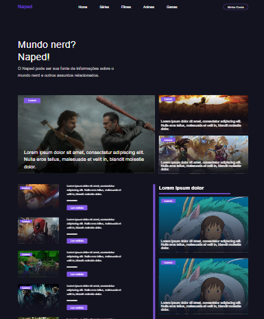
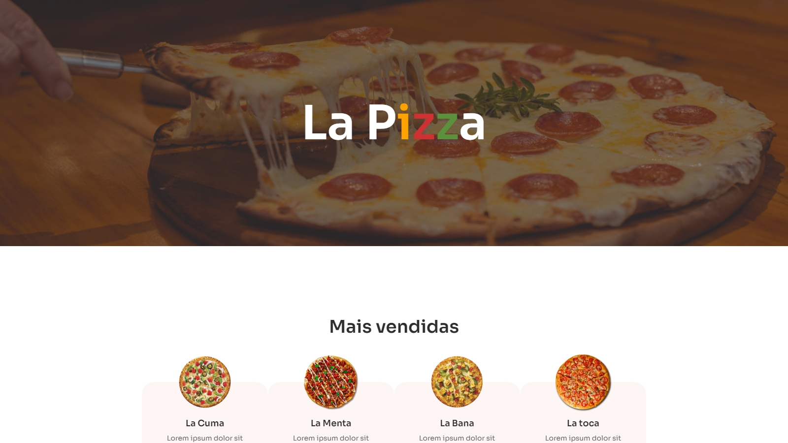

<h1 align="center">Desafios Codelândia</h1>

Os projetos são desafios proposto pela comunidade <a href="https://discord.gg/wNCWTVuxyz">@Codelândia</a>

# Blog 

  <a href="https://blog-codelandia-lucas.netlify.app/">
    <b>🚀 Visualizar</b>
  </a>
  &nbsp;&nbsp;▪&nbsp;&nbsp;
  <a href="https://github.com/lucasmoou/desafios-codelandia/tree/main/desafio1">
    <b>💻 Repositório</b>
  </a>

# Jordan Shoes 

  <a href="https://jordan-shoes-lucas.netlify.app/">
    <b>🚀 Visualizar</b>
  </a>
  &nbsp;&nbsp;▪&nbsp;&nbsp;
  <a href="https://github.com/lucasmoou/desafios-codelandia/tree/main/desafio02">
    <b>💻 Repositório</b>
  </a>

# One Page

  <a href="https://one-page-lucas.netlify.app/">
    <b>🚀 Visualizar</b>
  </a>
  &nbsp;&nbsp;▪&nbsp;&nbsp;
  <a href="https://github.com/lucasmoou/desafios-codelandia/tree/main/desafio03">
    <b>💻 Repositório</b>
  </a>

# Login

  <a href="https://login-lucas.netlify.app/">
    <b>🚀 Visualizar</b>
  </a>
  &nbsp;&nbsp;▪&nbsp;&nbsp;
  <a href="https://github.com/lucasmoou/desafios-codelandia/tree/main/desafio04">
    <b>💻 Repositório</b>
  </a>

# Viagem Chihiro

  <a href="https://viagem-chihiro.netlify.app/">
    <b>🚀 Visualizar</b>
  </a>
  &nbsp;&nbsp;▪&nbsp;&nbsp;
  <a href="https://github.com/lucasmoou/desafios-codelandia/tree/main/desafio05">
    <b>💻 Repositório</b>
  </a>

# Loki

  <a href="https://loki-lucas.netlify.app/">
    <b>🚀 Visualizar</b>
  </a>
  &nbsp;&nbsp;▪&nbsp;&nbsp;
  <a href="https://github.com/lucasmoou/desafios-codelandia/tree/main/desafio06">
    <b>💻 Repositório</b>
  </a>

# Valorant 

  <a href="https://valorant-lucas.netlify.app/">
    <b>🚀 Visualizar</b>
  </a>
  &nbsp;&nbsp;▪&nbsp;&nbsp;
  <a href="https://github.com/lucasmoou/desafios-codelandia/tree/main/desafio07">
    <b>💻 Repositório</b>
  </a>

# Naped 

  <a href="https://github.com/lucasmoou/desafios-codelandia/tree/main/desafio10">
    <b>💻 Repositório</b>
  </a>

# La Pizza 

  <a href="https://lapizza-lucas.netlify.app/">
    <b>🚀 Visualizar</b>
  </a>
  &nbsp;&nbsp;▪&nbsp;&nbsp;
  <a href="https://github.com/lucasmoou/desafios-codelandia/tree/main/desafio12">
    <b>💻 Repositório</b>
  </a>

